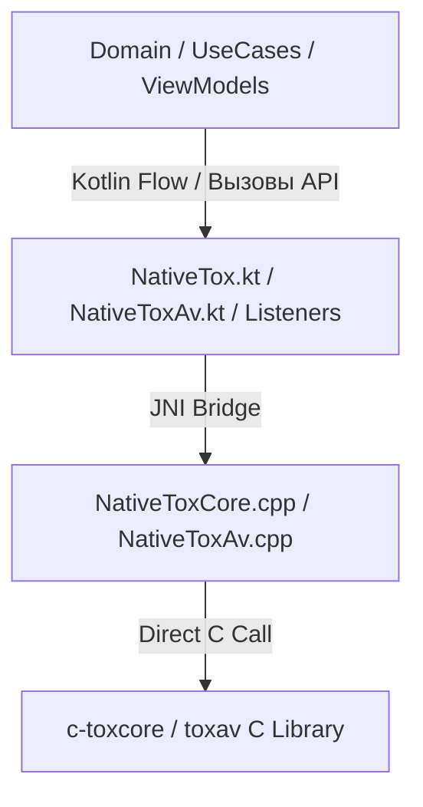

# Руководство разработчика: Работа с JNI-слоем Tox (модуль Core)

Данный документ описывает архитектуру нативного JNI-слоя, работу с шиной событий ToxEventListener и ToxAvEventListener, а также использование низкоуровневых интерфейсов NativeTox и NativeToxAv для реализации P2P-коммуникаций, групповых чатов нового поколения (NGC) и аудио-видео звонков в приложении aTox.

---

## 1. Архитектура и основные компоненты

P2P-слой построен как трехслойный мост между нативной библиотекой c-toxcore на языке C++ и кодовой базой Kotlin на стороне Android:



### Описание слоев:
1. **c-toxcore и toxav (C Library)**: Оригинальная библиотека протокола Tox. Отвечает за шифрование (NaCl), установку DHT-соединений, маршрутизацию UDP/TCP пакетов, аудио-видео кодеки (Opus/VP8) и организацию сетевого трафика.
2. **NativeToxCore.cpp и NativeToxAv.cpp (JNI C++)**: Прослойка на C++, которая транслирует вызовы из Java/Kotlin-окружения в вызовы функций Tox Core, конвертирует типы данных (массивы байт jbyteArray <-> uint8_t*, массивы short jshortArray <-> int16_t*) и кэширует Method IDs слушателей для диспетчеризации асинхронных коллбеков.
3. **NativeTox.kt и NativeToxAv.kt (JNI Bridge)**: Kotlin-интерфейсы с объявлением external fun методов. Содержат детальное KDoc-описание всех методов.
4. **ToxEventListener.kt и ToxAvEventListener.kt (Event Loop Dispatchers)**: Центральные Kotlin-приемники событий от C++ слоя. Вся диспетчеризация входящих сообщений, файлов, приглашений и звонков проходит через их типизированные typealias лямбды.

---

## 2. Жизненный цикл и потокобезопасность (Thread Safety)

Библиотека Tox не является потокобезопасной. Запрещено параллельно вызывать нативные методы Tox из разных потоков JVM без надлежащей синхронизации.
Все вызовы JNI-методов NativeTox и цикл интеграции событий должны осуществляться строго в однопоточном диспетчере (Single-Threaded Dispatcher) или быть защищены блокировкой.

### Нативный Event Loop (toxIterate / toxavIterate)
События из сети Tox не приходят мгновенно сами по себе. Ядро Tox должно регулярно опрашиваться методом `toxIterate()`, а мультимедийный слой - методом `toxavIterate()`. Они должны вызываться последовательно из выделенного потока.

**Пример бесконечного цикла ядра:**
```kotlin
val toxThread = Executors.newSingleThreadScheduledExecutor()

toxThread.submit {
    while (isToxRunning) {
        // Проводим сетевую итерацию для ядра
        NativeTox.toxIterate(toxPointer, coreListener)
        
        // Спрашиваем у ядра рекомендованное время ожидания
        val coreInterval = NativeTox.toxIterationInterval(toxPointer)
        
        // Проводим сетевую итерацию для мультимедиа
        if (avPointer != 0L) {
            NativeToxAv.toxavIterate(avPointer, avListener)
        }
        
        Thread.sleep(coreInterval.toLong())
    }
}
```

---

## 3. Полный перечень JNI методов NativeTox (100% покрытия)

### 3.1. Жизненный цикл и инициализация
* **toxNewWithOptions(savedata: ByteArray?, ipv6Enabled: Boolean, udpEnabled: Boolean, localDiscoveryEnabled: Boolean, proxyType: Int, proxyHost: String?, proxyPort: Int): Long**
  Инициализирует и запускает новый инстанс Tox. Возвращает нативный указатель (Long). В случае ошибки возвращает 0.
* **toxGetSavedata(toxPtr: Long): ByteArray**
  Сериализует текущее состояние инстанса Tox в байтовый массив для последующего сохранения в файловую систему.
* **toxKill(toxPtr: Long)**
  Уничтожает нативный инстанс Tox и освобождает всю связанную с ним память.
* **toxIterate(toxPtr: Long, listener: ToxEventListener)**
  Проводит одну сетевую итерацию обработки пакетов и вызывает callback-события через listener.
* **toxIterationInterval(toxPtr: Long): Int**
  Возвращает интервал времени в миллисекундах перед следующей необходимой итерацией.

### 3.2. Настройки локального узла (Self)
* **toxSelfGetConnectionStatus(toxPtr: Long): Int**
  Возвращает статус подключения к сети DHT (0 - офлайн, 1 - онлайн через TCP, 2 - онлайн напрямую по UDP).
* **toxSelfGetAddress(toxPtr: Long): ByteArray**
  Возвращает полный 76-байтовый адрес Tox ID текущего узла.
* **toxSelfGetDhtId(toxPtr: Long): ByteArray**
  Возвращает публичный ключ DHT текущего узла (32 байта).
* **toxSelfGetUdpPort(toxPtr: Long): Int**
  Возвращает UDP порт, занятый текущим узлом.
* **toxSelfGetTcpPort(toxPtr: Long): Int**
  Возвращает TCP порт, занятый текущим узлом.
* **toxSelfGetSecretKey(toxPtr: Long): ByteArray**
  Возвращает 32-байтовый секретный ключ инстанса.
* **toxSelfGetPublicKey(toxPtr: Long): ByteArray**
  Возвращает 32-байтовый публичный ключ инстанса.
* **toxSelfSetName(toxPtr: Long, name: ByteArray)**
  Устанавливает имя локального пользователя.
* **toxSelfSetStatusMessage(toxPtr: Long, statusMessage: ByteArray)**
  Устанавливает статусное сообщение локального пользователя.
* **toxSelfSetStatus(toxPtr: Long, status: Int)**
  Устанавливает статус локального пользователя (0 - сеть, 1 - отошел, 2 - занят).
* **toxSelfSetTyping(toxPtr: Long, friendNumber: Int, isTyping: Boolean)**
  Передает другу статус того, набирает ли локальный пользователь текст сообщения.

### 3.3. Управление контактами (Friends)
* **toxFriendAdd(toxPtr: Long, address: ByteArray, message: ByteArray): Int**
  Отправляет запрос на добавление в друзья. Возвращает номер друга или отрицательное число при ошибке.
* **toxFriendAddNorequest(toxPtr: Long, publicKey: ByteArray): Int**
  Добавляет друга без отправки запроса (например, при импорте базы данных).
* **toxFriendDelete(toxPtr: Long, friendNumber: Int)**
  Удаляет друга из списка контактов.
* **toxFriendExists(toxPtr: Long, friendNumber: Int): Boolean**
  Проверяет, существует ли друг с указанным номером.
* **toxFriendGetConnectionStatus(toxPtr: Long, friendNumber: Int): Int**
  Получает статус сетевого соединения с другом (0 - офлайн, 1 - онлайн через TCP, 2 - онлайн по UDP).
* **toxFriendGetLastOnline(toxPtr: Long, friendNumber: Int): Long**
  Возвращает UNIX-время последнего зафиксированного пребывания друга в сети.
* **toxFriendSendMessage(toxPtr: Long, friendNumber: Int, type: Int, message: ByteArray): Int**
  Отправляет текстовое сообщение другу. Возвращает уникальный идентификатор сообщения.
* **toxFriendGetName(toxPtr: Long, friendNumber: Int): ByteArray**
  Возвращает имя указанного друга.
* **toxFriendGetStatusMessage(toxPtr: Long, friendNumber: Int): ByteArray**
  Возвращает статусное сообщение указанного друга.
* **toxFriendGetStatus(toxPtr: Long, friendNumber: Int): Int**
  Возвращает статус доступности друга.
* **toxFriendGetTyping(toxPtr: Long, friendNumber: Int): Boolean**
  Проверяет, набирает ли друг сообщение в данный момент.
* **toxFriendSendLosslessPacket(toxPtr: Long, friendNumber: Int, packet: ByteArray)**
  Отправляет пользовательский пакет данных гарантированной доставки (Lossless). Первым байтом должен быть заголовок пакета в диапазоне 160-191.
* **toxFriendSendLossyPacket(toxPtr: Long, friendNumber: Int, packet: ByteArray)**
  Отправляет пользовательский пакет данных без гарантии доставки (Lossy). Первым байтом должен быть заголовок пакета в диапазоне 192-254.
* **toxBootstrap(toxPtr: Long, address: String, port: Int, publicKey: ByteArray)**
  Подключается к публичному DHT-узлу для входа в глобальную P2P сеть.
* **toxAddTcpRelay(toxPtr: Long, address: String, port: Int, publicKey: ByteArray)**
  Добавляет резервную TCP-ноду (relay) для обхода жестких ограничений NAT/брандмауэров.

### 3.4. Передача файлов (File Transfers)
* **toxFileControl(toxPtr: Long, friendNumber: Int, fileNumber: Int, control: Int)**
  Управляет сессией передачи файла (0 - возобновить/принять, 1 - пауза, 2 - отмена).
* **toxFileSend(toxPtr: Long, friendNumber: Int, kind: Int, fileSize: Long, fileId: ByteArray?, fileName: ByteArray): Int**
  Инициирует отправку файла другу. Возвращает номер файла.
* **toxFileSendChunk(toxPtr: Long, friendNumber: Int, fileNumber: Int, position: Long, chunk: ByteArray)**
  Передает конкретный блок байтов файла.
* **toxFileGetFileId(toxPtr: Long, friendNumber: Int, fileNumber: Int): ByteArray**
  Получает уникальный идентификатор файла в текущей сессии передачи.

### 3.5. Классические конференции (Legacy Conferences)
* **toxConferenceNew(toxPtr: Long): Int**
  Создает новую локальную текстовую конференцию.
* **toxConferenceDelete(toxPtr: Long, conferenceNumber: Int)**
  Удаляет конференцию.
* **toxConferenceInvite(toxPtr: Long, friendNumber: Int, conferenceNumber: Int)**
  Отправляет другу приглашение в конференцию.
* **toxConferenceJoin(toxPtr: Long, friendNumber: Int, cookie: ByteArray): Int**
  Принимает входящее приглашение и подключается к конференции.
* **toxConferenceSendMessage(toxPtr: Long, conferenceNumber: Int, type: Int, message: ByteArray): Int**
  Отправляет сообщение в конференцию.
* **toxConferenceSetTitle(toxPtr: Long, conferenceNumber: Int, title: ByteArray)**
  Изменяет тему конференции.
* **toxConferenceGetTitle(toxPtr: Long, conferenceNumber: Int): ByteArray**
  Возвращает текущую тему конференции.
* **toxConferencePeerNumberIsOurself(toxPtr: Long, conferenceNumber: Int, peerNumber: Int): Boolean**
  Проверяет, относится ли указанный номер участника к локальному пользователю.
* **toxConferenceGetPeerCount(toxPtr: Long, conferenceNumber: Int): Int**
  Возвращает количество участников в конференции.
* **toxConferenceGetPeerName(toxPtr: Long, conferenceNumber: Int, peerNumber: Int): ByteArray**
  Получает имя указанного участника конференции.
* **toxConferenceGetPeerPublicKey(toxPtr: Long, conferenceNumber: Int, peerNumber: Int): ByteArray**
  Получает публичный ключ указанного участника конференции.
* **toxConferenceGetChatlist(toxPtr: Long): IntArray**
  Возвращает список идентификаторов всех активных конференций.
* **toxConferenceGetType(toxPtr: Long, conferenceNumber: Int): Int**
  Возвращает тип конференции (0 - текст, 1 - аудио/видео).

### 3.6. Групповые чаты нового поколения (NGC Groups / Modern Conferences)
* **toxGroupNew(toxPtr: Long, privacyState: Int, groupName: ByteArray, selfName: ByteArray): Int**
  Создает новую защищенную группу NGC с определенным типом приватности (0 - публичная, 1 - приватная).
* **toxGroupJoin(toxPtr: Long, friendNumber: Int, inviteData: ByteArray, selfName: ByteArray, password: ByteArray?): Int**
  Присоединяется к группе NGC по полученному приглашению, с возможностью передачи пароля для защищенных паролем групп.
* **toxGroupLeave(toxPtr: Long, groupNumber: Int): Boolean**
  Покидает группу NGC.
* **toxGroupSendMessage(toxPtr: Long, groupNumber: Int, type: Int, message: ByteArray): Int**
  Отправляет сообщение в группу NGC. Возвращает номер сообщения.
* **toxGroupSetTopic(toxPtr: Long, groupNumber: Int, topic: ByteArray): Boolean**
  Устанавливает тему группы NGC.
* **toxGroupGetTopic(toxPtr: Long, groupNumber: Int): ByteArray**
  Получает текущую тему группы NGC.
* **toxGroupGetName(toxPtr: Long, groupNumber: Int): ByteArray**
  Получает имя группы NGC.
* **toxGroupGetChatId(toxPtr: Long, groupNumber: Int): ByteArray**
  Возвращает уникальный постоянный 32-байтовый идентификатор чата группы NGC.
* **toxGroupSetPassword(toxPtr: Long, groupNumber: Int, password: ByteArray?): Boolean**
  Устанавливает или сбрасывает пароль для входа в группу NGC.
* **toxGroupGetPassword(toxPtr: Long, groupNumber: Int): ByteArray**
  Получает текущий пароль группы NGC.
* **toxGroupPeerGetName(toxPtr: Long, groupNumber: Int, peerId: Int): ByteArray**
  Получает имя участника группы по его идентификатору.
* **toxGroupPeerGetPublicKey(toxPtr: Long, groupNumber: Int, peerId: Int): ByteArray**
  Получает публичный ключ участника группы по его идентификатору.
* **toxGroupSelfGetPeerId(toxPtr: Long, groupNumber: Int): Int**
  Возвращает наш личный Peer ID в данной группе.
* **toxGroupSelfGetRole(toxPtr: Long, groupNumber: Int): Int**
  Возвращает роль локального пользователя в группе (0 - гость, 1 - модератор, 2 - администратор).

---

## 4. Полный перечень JNI методов NativeToxAv (100% покрытия)

### 4.1. Управление мультимедиа-сессией
* **toxavNew(toxPtr: Long): Long**
  Инициализирует и запускает мультимедийную AV сессию на базе активного инстанса Tox. Возвращает нативный указатель (Long).
* **toxavKill(avPtr: Long)**
  Уничтожает AV сессию и завершает все активные вызовы.
* **toxavIterate(avPtr: Long, listener: ToxAvEventListener)**
  Проводит обработку кадров и аудиопотоков AV сессии с вызовом обратных методов интерфейса listener.
* **toxavIterationInterval(avPtr: Long): Int**
  Возвращает оптимальный интервал ожидания в миллисекундах перед следующей итерацией.

### 4.2. Индивидуальные звонки (1-to-1 Calls)
* **toxavCall(avPtr: Long, friendNumber: Int, audioBitrate: Int, videoBitrate: Int): Boolean**
  Инициирует исходящий звонок другу с указанием битрейтов (в кбит/с) для аудио и видео.
* **toxavAnswer(avPtr: Long, friendNumber: Int, audioBitrate: Int, videoBitrate: Int): Boolean**
  Принимает входящий звонок от друга.
* **toxavCallControl(avPtr: Long, friendNumber: Int, control: Int): Boolean**
  Отправляет сигнал управления вызовом (0 - продолжить, 1 - пауза/hold, 2 - отмена/сброс, 3 - выключить микрофон, 4 - включить микрофон, 5 - скрыть наше видео, 6 - показать наше видео).
* **toxavAudioSendFrame(avPtr: Long, friendNumber: Int, pcm: ShortArray, sampleCount: Int, channels: Int, samplingRate: Int): Boolean**
  Отправляет аудио-кадр PCM другу. Размер массива pcm должен быть равен `sampleCount * channels`.
* **toxavVideoSendFrame(avPtr: Long, friendNumber: Int, width: Int, height: Int, yPlane: ByteArray, uPlane: ByteArray, vPlane: ByteArray): Boolean**
  Отправляет видео-кадр YUV420P другу.
* **toxavAudioSetBitRate(avPtr: Long, friendNumber: Int, bitrate: Int): Boolean**
  Динамически перестраивает аудио-битрейт прямо во время звонка.
* **toxavVideoSetBitRate(avPtr: Long, friendNumber: Int, bitrate: Int): Boolean**
  Динамически перестраивает видео-битрейт прямо во время звонка.

### 4.3. Групповые звонки (Group AV Calls)
* **toxavAddAvGroupchat(toxPtr: Long): Int**
  Создает новый аудио-видео групповой чат.
* **toxavJoinAvGroupchat(toxPtr: Long, groupNumber: Int): Int**
  Активирует аудио-видео функции для группы, к которой пользователь уже подключен.
* **toxavGroupSendAudio(toxPtr: Long, groupNumber: Int, pcm: ShortArray, sampleCount: Int, channels: Int, samplingRate: Int): Int**
  Транслирует собственный аудио-кадр PCM всем участникам группового звонка.
* **toxavGroupchatEnableAv(toxPtr: Long, groupNumber: Int): Int**
  Включает AV функции для указанной текстовой группы.
* **toxavGroupchatDisableAv(toxPtr: Long, groupNumber: Int): Int**
  Выключает AV функции для указанной группы.
* **toxavGroupchatAvEnabled(toxPtr: Long, groupNumber: Int): Boolean**
  Проверяет, включена ли трансляция звука в данной группе.

---

## 5. Форматы передачи мультимедиа данных

### 5.1. Аудиоданные (PCM)
Аудиоданные передаются в формате сырых 16-битных PCM отсчетов со знаком (short).
Для стерео канала отсчеты чередуются: `[L1][R1][L2][R2]...`
Допустимая длительность одного аудио-фрейма: 2.5, 5, 10, 20, 40 или 60 миллисекунд.
Количество сэмплов вычисляется по формуле: `sampleCount = samplingRate * frameDurationMs / 1000`.
Рекомендованные параметры отправки: частота дискретизации 48000 Гц, моно канал, длительность 20 мс (960 сэмплов).

### 5.2. Видеоданные (YUV420P)
Видеоданные принимаются и передаются исключительно как плоский YUV420P формат:

```
+------------------------------------+
|                                    |
|              Y-Plane               |  Размер: width * height
|           (Яркостный)              |
|                                    |
+-----------------+------------------+
|     U-Plane     |     V-Plane      |  Размер каждого: (width/2) * (height/2)
|  (Цветоразност) |  (Цветоразност)  |
+-----------------+------------------+
```

Для корректной отправки кадра с мобильной камеры Android необходимо предварительно перекодировать фрейм (например, из NV21 или YV12) в YUV420P планарный буфер, разбив его на 3 независимых массива байтов, и передать их в метод `toxavVideoSendFrame`.

---

## 6. Диспетчеризация обратных вызовов (JNI Callback Tables)

### 6.1. События ядра (NativeToxCore)

| Функция обратного вызова C++ | Метод Kotlin в ToxEventListener | Сигнатура JVM | Описание события |
| --- | --- | --- | --- |
| `cb_friend_message` | `onFriendMessage` | `(III[BI)V` | Получено сообщение от друга |
| `cb_friend_request` | `onFriendRequest` | `([B[B)V` | Запрос на добавление в друзья |
| `cb_self_connection_status` | `onSelfConnectionStatus` | `(I)V` | Смена сетевого статуса узла |
| `cb_friend_connection_status` | `onFriendConnectionStatus` | `(II)V` | Смена статуса соединения друга |
| `cb_friend_name` | `onFriendName` | `(I[B)V` | Друг изменил свое имя |
| `cb_friend_status_message` | `onFriendStatusMessage` | `(I[B)V` | Друг изменил статус-сообщение |
| `cb_friend_status` | `onFriendStatus` | `(II)V` | Друг изменил статус доступности |
| `cb_friend_typing` | `onFriendTyping` | `(IZ)V` | Друг начал или закончил ввод |
| `cb_friend_read_receipt` | `onFriendReadReceipt` | `(II)V` | Подтверждение прочтения сообщения |
| `cb_file_recv` | `onFileRecv` | `(IIIJ[B)V` | Входящий файл от друга |
| `cb_file_recv_control` | `onFileRecvControl` | `(III)V` | Сигнал управления файлом от друга |
| `cb_file_recv_chunk` | `onFileRecvChunk` | `(IIJ[B)V` | Получен блок данных файла |
| `cb_file_chunk_request` | `onFileChunkRequest` | `(IIJI)V` | Друг запросил блок данных файла |
| `cb_friend_lossless_packet` | `onFriendLosslessPacket` | `(I[B)V` | Получен пользовательский Lossless-пакет |
| `cb_friend_lossy_packet` | `onFriendLossyPacket` | `(I[B)V` | Получен пользовательский Lossy-пакет |
| `cb_group_invite` | `onGroupInvite` | `(I[B[B)V` | Получено приглашение в NGC-группу |
| `cb_group_message` | `onGroupMessage` | `(III[BI)V` | Новое сообщение в NGC-группе |
| `cb_group_peer_join` | `onGroupPeerJoin` | `(II)V` | Участник вошел в NGC-группу |
| `cb_group_peer_exit` | `onGroupPeerExit` | `(III)V` | Участник вышел из NGC-группы |
| `cb_group_topic` | `onGroupTopic` | `(II[B)V` | Смена темы NGC-группы |
| `cb_group_peer_name` | `onGroupPeerName` | `(II[B)V` | Участник NGC-группы сменил имя |
| `cb_group_password` | `onGroupPassword` | `(I[B)V` | Изменился пароль NGC-группы |
| `cb_group_peer_status` | `onGroupPeerStatus` | `(III)V` | Изменился статус присутствия участника NGC-группы |
| `cb_group_privacy_state` | `onGroupPrivacyState` | `(II)V` | Изменился тип приватности NGC-группы |
| `cb_group_voice_state` | `onGroupVoiceState` | `(II)V` | Изменился голосовой статус (режим разговора) NGC-группы |
| `cb_group_topic_lock` | `onGroupTopicLock` | `(II)V` | Изменение блокировки установки темы NGC-группы |
| `cb_group_peer_limit` | `onGroupPeerLimit` | `(II)V` | Изменился лимит количества участников NGC-группы |
| `cb_group_private_message` | `onGroupPrivateMessage` | `(III[BI)V` | Получено приватное сообщение внутри NGC-группы |
| `cb_group_self_join` | `onGroupSelfJoin` | `(I)V` | Клиент успешно вошел в NGC-группу |
| `cb_group_join_fail` | `onGroupJoinFail` | `(II)V` | Ошибка подключения клиента к NGC-группе |
| `cb_group_moderation` | `onGroupModeration` | `(IIII)V` | Административные (модерационные) действия в NGC-группе |

### 6.2. События мультимедиа (NativeToxAv)

| Функция обратного вызова C++ | Метод Kotlin в ToxAvEventListener | Сигнатура JVM | Описание события |
| --- | --- | --- | --- |
| `cb_call` | `onCall` | `(IZZ)V` | Входящий вызов от друга |
| `cb_call_state` | `onCallState` | `(II)V` | Изменился статус текущего звонка |
| `cb_audio_receive_frame` | `onAudioReceiveFrame` | `(I[SIII)V` | Получен входящий аудио-кадр PCM |
| `cb_video_receive_frame` | `onVideoReceiveFrame` | `(III[B[B[BIII)V` | Получен входящий видео-кадр YUV420P |
| `cb_audio_bit_rate` | `onAudioBitRate` | `(II)V` | Сетевая рекомендация сменить аудио-битрейт |
| `cb_video_bit_rate` | `onVideoBitRate` | `(II)V` | Сетевая рекомендация сменить видео-битрейт |
| `cb_group_audio` | `onGroupAudio` | `(II[SIII)V` | Получен звук от участника группового звонка |

---

## 7. Рекомендации по интеграции с базой данных (Android Room)

Для обеспечения надежного и бесшовного пользовательского опыта:
1. **Кэшируйте все данные в Room**: Нативные инстансы Tox хранят список участников, историю сообщений и темы групп исключительно в оперативной памяти в течение текущей сессии. Чтобы избежать пустых экранов при перезапуске приложения, все события из listener-интерфейсов должны незамедлительно кэшироваться в локальную базу данных.
2. **Используйте реактивные Kotlin Flow**: Все Compose или XML элементы интерфейса должны подписываться исключительно на обновления из Room (через Flow/LiveData), а не запрашивать JNI-слой напрямую при каждой перерисовке.
3. **Безопасное автосохранение**: Периодически (например, раз в 5 минут или после добавления нового друга/группы) вызывайте метод `NativeTox.toxGetSavedata(toxPtr)` и перезаписывайте бинарный файл профиля на диске. Это предотвратит потерю ценных криптографических ключей при внезапной остановке процесса операционной системой.
